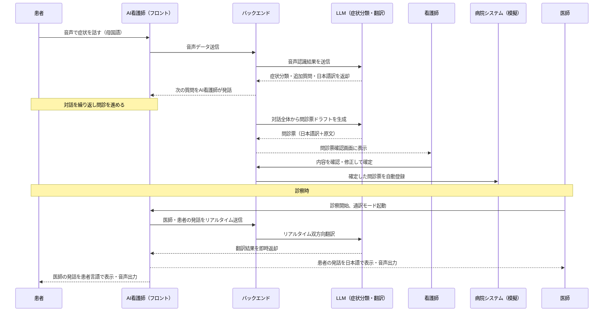

# NurseLink AI（仮称）
### 言葉の壁と看護師不足を同時に解決する、多言語対応AI看護師アプリ

---

## 📌 概要

**NurseLink AI** は、画面の中にいるキャラクター型のAI看護師と患者が母国語で会話するだけで、問診票の自動作成・多言語翻訳・病院システムへの登録・診察時の通訳までを一気通貫で行うアプリです。

外国人患者は日本語が話せなくても、AI看護師に症状を話すだけで問診が完了します。医療者側は、患者の発話が自動で日本語に翻訳された問診票として届き、内容を確認するだけで電子カルテ相当のシステムへ登録できます。さらに実際の診察の場面でも、同じAI看護師キャラクターが医師と患者の会話をリアルタイムで通訳します。

## 🎯 解決する課題

| 課題 | 現状 |
|---|---|
| 言葉の壁 | 外国人患者とのコミュニケーション不足が誤診・医療事故のリスクになっている |
| 看護師不足 | 2025年には最大約27万人の看護師が不足すると厚生労働省が試算。問診・説明・通訳などの付随業務が看護師の負担を増やしている |

多言語対応を自動化することは、そのまま看護師の負担軽減につながる — この2つの課題の重なりが本プロジェクトの出発点です。

## 🌟 差別化ポイント

既存の「AI問診」（Ubie等）や「医療通訳AI」（mediPhone、MELON、KOTOBAL等）は個別に存在しますが、本プロジェクトの独自性は**組み合わせ方**にあります。

- **ツールではなくキャラクター**：無機質な翻訳ツールではなく対話キャラクターにすることで、患者の心理的ハードルを下げる
- **受付から診察までワンストップ**：問診・翻訳・登録・診察通訳を1つのキャラクター体験としてつなぐ
- **人間看護師とのダブルチェックを前提設計**：AIが下書きし、看護師が確認・修正して確定するHuman-in-the-loop運用

---

## 🖥️ 主な機能

| # | 機能 | 内容 |
|---|---|---|
| 0 | 録音同意取得 | 音声送信・保存についての同意を明示的に取得してから問診対話を開始 |
| 1 | 多言語音声問診 | AI看護師キャラクターが患者と母国語で対話し、症状に応じて質問を動的生成（質問は事前定義テンプレートの範囲内） |
| 2 | 問診票の自動生成 | 対話内容から症状カテゴリを分類し、日本語の問診票ドラフトを自動作成（構造化JSON出力、自由記述の診断文は生成しない） |
| 3 | 看護師確認・修正 | 看護師がAI生成の問診票を確認・修正して確定するレビュー画面 |
| 4 | 病院システムへの自動登録 | 確定した問診票を模擬病院システム（電子カルテ相当）にワンクリック登録 |
| 5 | 診察時通訳（疑似リアルタイム） | 医師⇄外国人患者の会話を発話ブロック単位でAI看護師が双方向翻訳（真のストリーミング型はCould） |
| 6 | 通訳呼び出し | 看護師が患者と直接会話する場面でAI看護師を通訳として即座に起動 |
| 7 | 問診票の紙出力 | 看護師が②で確定した時点で、その問診票をPDF（印刷用）として自動生成しその場で印刷・ダウンロード可能にする。Excel／Word形式でのエクスポートは事務での再編集用途として提供（Should） |
| 8 | 看護師ログイン認証 | ②③④はSupabase Authによるログインが必須。未ログインでは開けず、確定操作の記録も認証済みユーザーIDに紐づく |

---

## 📱 画面設計

### 画面一覧

⓪①（患者向け）と②③④（スタッフ向け）は、**別々のアプリとして配信を分離している**（後述「フロント2アプリ構成」）。患者の端末にスタッフ用画面のコードが配られることはなく、②③④はログインなしでは開けない。

| 画面名 | 利用者 | 目的・主要要素 |
|---|---|---|
| ⓪ 同意画面 | 患者 | 音声録音・送信・保存についての同意取得。同意なしでは①に進めない |
| ① 問診対話画面 | 患者 | AI看護師キャラクターとの音声対話。字幕表示、マイクボタン、症状選択の補助UI。完了後は患者向けの完了画面（お待ちください）に遷移する |
| （ログイン画面） | 看護師・医師 | Supabase Authによるメール＋パスワード認証。未ログインでは②③④に入れない |
| ② 問診票確認画面 | 看護師 | 受付キュー（実際の待機患者一覧）とAIが生成した問診票（日本語翻訳済み）の一覧、修正・確定ボタン、原文（患者の言語）との対訳表示。確定と同時にPDF（印刷用）を自動生成し印刷・ダウンロード可能にする |
| ③ 通訳呼び出し画面 | 看護師 | ワンタップでAI看護師をリアルタイム通訳として起動、対応言語の選択 |
| ④ 診察通訳画面 | 医師・患者 | 医師⇄患者の発話をリアルタイム字幕・音声で双方向表示、問診内容のサマリーを常時表示 |
| ⑤ 管理・ログ画面（発展機能） | 看護師長・事務 | 問診履歴、修正履歴、対応言語の利用統計（未着手） |

### 画面遷移（ワイヤーフレーム概略）

```
[受付タブレット]
   ⓪同意画面（患者）
        │ 同意取得
        ▼
   ①問診対話画面（患者）
        │ 対話完了・問診票ドラフト生成
        ▼
   ②問診票確認画面（看護師）
        │ 確認・修正 → 確定
        ├─▶ 病院システムへ自動登録
        └─▶ 問診票（紙版）を自動生成 → 印刷／ダウンロード（PDF必須、Excel・Wordは追加エクスポート）
        │
        ▼
[診察室]
   ③通訳呼び出し画面（看護師）─必要時─▶ ④診察通訳画面（医師・患者）
        （②で登録済みの問診サマリーを④に自動引き継ぎ）
```

---

## 🛠️ 技術スタック

| レイヤー | 技術 | 用途・補足 |
|---|---|---|
| フロントエンド | React（PWA） | npmワークスペースで3つに分離（下記「フロント2アプリ構成」参照）。manifest.json + Service Workerでホーム画面追加・簡易オフライン対応（患者アプリのみ） |
| 認証 | Supabase Auth | 看護師・医師のログイン（メール＋パスワード）。スタッフアプリのみが使う |
| キャラクター表現 | インラインSVG（2Dイラストベース） | 口パク・表情変化を共有コンポーネントとして実装 |
| 音声認識（STT） | Whisper API（OpenAI、サーバー経由に統一） | iOS Safari等はブラウザ内蔵の音声認識APIが使えないため、Web Speech APIには依存しない。APIキー未設定時はモック応答にフォールバック |
| 音声合成（TTS） | TTS API（OpenAI） | AI看護師キャラクターの音声出力。APIキー未設定時は字幕表示のみにフォールバック |
| 翻訳・症状分類・問診生成 | Deepseek API | 症状カテゴリ分類、多言語翻訳。出力は構造化JSONに固定し自由記述の診断文は生成させない。質問文自体は事前定義テンプレート（7言語）から選ぶ |
| バックエンド | Python（FastAPI） | 音声〜翻訳〜問診生成パイプラインの制御、API集約、通訳モードのWebSocket通信。②③④のAPI・WebSocketはSupabase Authのトークン検証必須 |
| 帳票出力（紙版問診票） | ReportLab（PDF）／python-docx（Word）／openpyxl（Excel） | 看護師の確定操作をトリガーにバックエンドで生成。PDFは実装済み、Word/Excelは未着手（Should）。ReportLabは純Python実装でOS依存のネイティブライブラリ（GTK等）が不要 |
| データベース／模擬病院システム／認証基盤 | Supabase | 問診データの保存（模擬電子カルテ）とSupabase Authを兼ねる |
| ホスティング（フロント） | Vercel | 患者アプリ・スタッフアプリをそれぞれ別プロジェクトとしてデプロイ |
| ホスティング（バックエンド） | Fly.io | FastAPI・WebSocket常駐プロセスを稼働。東京(nrt)リージョン |

### フロント2アプリ構成

患者とスタッフでは利用デバイス（患者＝スマホ、スタッフ＝タブレット/PC）だけでなく、**アクセスできる情報自体が違う**ため、フロントエンドを物理的に2つのアプリへ分離している。ログインで画面を隠すだけでなく、患者の端末にスタッフ用画面のコードそのものが配信されない構成。

```
frontend-shared/   共有コード（ユイのキャラクター、UIコンポーネント、APIクライアント、型定義、音声録音フック）
frontend-patient/  患者アプリ（⓪①＋使い方ガイド）。ログイン不要、PWA対応
frontend-staff/    スタッフアプリ（ログイン＋②③④）。Supabase Authログイン必須
```
npmワークスペース（ルートの`package.json`）で依存関係を共有し、React等の重複を避けている。

### 🌐 デプロイ済み環境

| 環境 | URL |
|---|---|
| 患者アプリ | https://nurselink-ai-patient.vercel.app |
| スタッフアプリ | https://nurselink-ai-staff.vercel.app |
| バックエンドAPI | https://nurselink-ai-backend.fly.dev |

---

## 🔄 処理の流れ



---

## 👥 チーム体制（3名）

| 担当 | 役割 |
|---|---|
| フロントエンド／UXデザイン | キャラクターUI、①②③④の画面実装 |
| バックエンド／AI設計 | 音声認識〜翻訳〜症状分類〜問診生成パイプライン、模擬病院システムAPI連携 |
| 企画・データ設計／ピッチ | 問診シナリオ設計、医療安全面の整理、発表資料・デモ台本の作成 |

---

## ⚠️ 前提・制約

- 本プロジェクトはAI問診・AI通訳による**診断や医行為は行わない**。あくまで問診支援・翻訳支援ツールであり、最終的な医学的判断は必ず有資格者が行う
  - ガードレール：症状分類・問診生成LLMの出力は事前定義された質問テンプレート／構造化JSONスキーマの範囲に限定し、診断・治療方針を示唆する自由記述文は生成させない。看護師の確認・修正を経なければ確定しない設計を維持する
- デモでは匿名の模擬データのみを使用する。実運用には個人情報保護法・要配慮個人情報の取り扱いに関する体制整備が別途必要
  - 患者の音声を録音・送信する前に⓪同意画面で明示的な同意を取得する（同意なしでは①に進めない）
- 実際の電子カルテ・病院基幹システムとの連携は、各社EHRベンダーとの個別対応が今後の課題
- モバイル利用を前提とするため、HTTPS必須・マイク権限はユーザー操作起点でのみ要求する（iOS Safariの制約に準拠）。院内Wi-Fi以外（モバイル回線）での通信不安定時の再試行・エラー表示を考慮する
- 全画面をデスクトップ・スマートフォンの両方でレスポンシブに表示できるようにする。特定デバイス幅を前提にした固定レイアウトにせず、ブレークポイントで画面幅に応じたレイアウトに切り替える
- 患者がスタッフ専用画面（②③④）に誤ってアクセスできないよう、ログイン制御だけでなくアプリ自体を分離する（「フロント2アプリ構成」参照）。バックエンドAPI側でも認証トークンを検証し、フロントを経由しない直接アクセスも防ぐ
- 対応言語は英語・日本語（標準／やさしい日本語）・中国語・ベトナム語・韓国語・ポルトガル語の7言語（⓪同意画面・①問診対話画面・問診質問テンプレートで対応）。日本語・英語以外はネイティブチェック未実施の機械翻訳のため、実運用前に現地話者の確認が望ましい

---

## 🚀 開発スコープ（MVP）

**Must（コンテストデモの核）— 実装・デプロイ済み**
- 同意取得 → 多言語音声問診（実音声認識・音声合成つき） → 症状分類 → 問診票生成 → 模擬システム登録（PWAとしてモバイル端末で動作）
- 看護師の確定操作をトリガーにした問診票PDFの自動生成・印刷／ダウンロード
- 看護師ログイン認証・患者アプリ/スタッフアプリの物理分離

**Should（時間があれば）— 実装済み**
- 診察時の疑似リアルタイム通訳モード（発話ブロック単位でのバッチ翻訳。真のストリーミング型は行わず、体験としての通訳フローを優先）。実音声認識・音声合成つき

**Should（未着手）**
- 問診票のWord／Excelエクスポート（事務での再編集用途）

**Could（将来構想）**
- 真のストリーミング型双方向リアルタイム通訳、実電子カルテとのAPI連携、対応言語のさらなる拡大、手話・筆談モード対応
