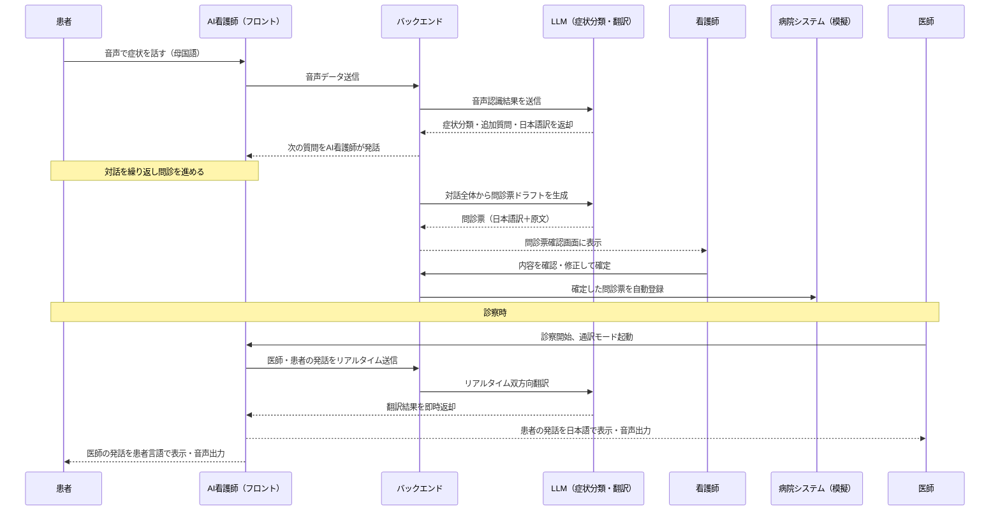

# NurseLink AI（仮称）
### 言葉の壁と看護師不足を同時に解決する、多言語対応AI看護師アプリ

---

## 📌 概要

**NurseLink AI** は、画面の中にいるキャラクター型のAI看護師と患者が母国語で会話するだけで、問診票の自動作成・多言語翻訳・病院システムへの登録・診察時の通訳までを一気通貫で行うアプリです。
9
外国人患者は日本語が話せなくても、AI看護師に症状を話すだけで問診が完了します。医療者側は、患者の発話が自動で日本語に翻訳された問診票として届き、内容を確認するだけで電子カルテ相当のシステムへ登録できます。さらに実際の診察の場面でも、同じAI看護師キャラクターが医師と患者の会話をリアルタイムで通訳します。

## 🎯 解決する課題

| 課題 | 現状 |
|---|---|
| 言葉の壁 | 外国人患者とのコミュニケーション不足が誤診・医療事故のリスクになっている |
| 看護師不足 | 2025年には最大約27万人の看護師が不足すると厚生労働省が試算。問診・説明・通訳などの付随業務が看護師の負担を増やしている |

多言語対応を自動化することは、そのまま看護師の負担軽減につながる — この2つの課題の重なりが本プロジェクトの出発点です。

## 🌟 差別化ポイント

既存の「AI問診」（Ubie等）や「医療通訳AI」（mediPhone、MELON、KOTOBAL等）は個別に存在しますが、本プロジェクトの独自性は**組み合わせ方**にあります。

- **ツールではなくキャラクター**：無機質な翻訳ツールではなく対話キャラクターにすることで、患者の心理的ハードルを下げる
- **受付から診察までワンストップ**：問診・翻訳・登録・診察通訳を1つのキャラクター体験としてつなぐ
- **人間看護師とのダブルチェックを前提設計**：AIが下書きし、看護師が確認・修正して確定するHuman-in-the-loop運用

---

## 🖥️ 主な機能

| # | 機能 | 内容 |
|---|---|---|
| 1 | 多言語音声問診 | AI看護師キャラクターが患者と母国語で対話し、症状に応じて質問を動的生成 |
| 2 | 問診票の自動生成 | 対話内容から症状カテゴリを分類し、日本語の問診票ドラフトを自動作成 |
| 3 | 看護師確認・修正 | 看護師がAI生成の問診票を確認・修正して確定するレビュー画面 |
| 4 | 病院システムへの自動登録 | 確定した問診票を模擬病院システム（電子カルテ相当）にワンクリック登録 |
| 5 | 診察時リアルタイム通訳 | 医師⇄外国人患者の会話をAI看護師が双方向にリアルタイム翻訳 |
| 6 | 通訳呼び出し | 看護師が患者と直接会話する場面でAI看護師を通訳として即座に起動 |

---

## 📱 画面設計

### 画面一覧

| 画面名 | 利用者 | 目的・主要要素 |
|---|---|---|
| ① 問診対話画面 | 患者 | AI看護師キャラクターとの音声対話。字幕表示、マイクボタン、症状選択の補助UI |
| ② 問診票確認画面 | 看護師 | AIが生成した問診票（日本語翻訳済み）の一覧、修正・確定ボタン、原文（患者の言語）との対訳表示 |
| ③ 通訳呼び出し画面 | 看護師 | ワンタップでAI看護師をリアルタイム通訳として起動、対応言語の選択 |
| ④ 診察通訳画面 | 医師・患者 | 医師⇄患者の発話をリアルタイム字幕・音声で双方向表示、問診内容のサマリーを常時表示 |
| ⑤ 管理・ログ画面（発展機能） | 看護師長・事務 | 問診履歴、修正履歴、対応言語の利用統計 |

### 画面遷移（ワイヤーフレーム概略）

```
[受付タブレット]
   ①問診対話画面（患者）
        │ 対話完了・問診票ドラフト生成
        ▼
   ②問診票確認画面（看護師）
        │ 確認・修正 → 確定
        ▼
   病院システムへ自動登録
        │
        ▼
[診察室]
   ③通訳呼び出し画面（看護師）─必要時─▶ ④診察通訳画面（医師・患者）
        （②で登録済みの問診サマリーを④に自動引き継ぎ）
```

---

## 🛠️ 技術スタック

| レイヤー | 技術候補 | 用途・補足 |
|---|---|---|
| フロントエンド | React | 各画面のUI実装 |
| キャラクター表現 | Lottie / CSSアニメーション（2Dイラストベース） | 口パク・表情変化。3Dアバターより短期実装向き |
| 音声認識（STT） | Whisper API または Web Speech API | 患者・医師の発話をテキスト化 |
| 音声合成（TTS） | クラウドTTS（多言語対応） | AI看護師キャラクターの音声出力 |
| 翻訳・症状分類・問診生成 | Deepseek API＋翻訳API | 症状カテゴリ分類、問診質問の動的生成、多言語翻訳 |
| バックエンド | Python（FastAPI） | 音声〜翻訳〜問診生成パイプラインの制御、API集約 |
| データベース／模擬病院システム | Supabase | 問診データの保存、模擬電子カルテAPIへの登録 |
| ホスティング | Vercel | デモ環境の公開 |

---

## 🔄 処理の流れ



---

## 👥 チーム体制（3名）

| 担当 | 役割 |
|---|---|
| フロントエンド／UXデザイン | キャラクターUI、①②③④の画面実装 |
| バックエンド／AI設計 | 音声認識〜翻訳〜症状分類〜問診生成パイプライン、模擬病院システムAPI連携 |
| 企画・データ設計／ピッチ | 問診シナリオ設計、医療安全面の整理、発表資料・デモ台本の作成 |

---

## ⚠️ 前提・制約

- 本プロジェクトはAI問診・AI通訳による**診断や医行為は行わない**。あくまで問診支援・翻訳支援ツールであり、最終的な医学的判断は必ず有資格者が行う
- デモでは匿名の模擬データのみを使用する。実運用には個人情報保護法・要配慮個人情報の取り扱いに関する体制整備が別途必要
- 実際の電子カルテ・病院基幹システムとの連携は、各社EHRベンダーとの個別対応が今後の課題

---

## 🚀 開発スコープ（MVP）

**Must（コンテストデモの核）**
- 1〜2言語での音声問診 → 症状分類 → 問診票生成 → 模擬システム登録

**Should（時間があれば）**
- 診察時リアルタイム双方向通訳モード

**Could（将来構想）**
- 実電子カルテとのAPI連携、対応言語の拡大、手話・筆談モード対応
